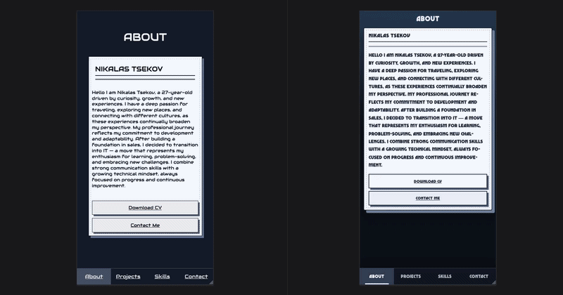
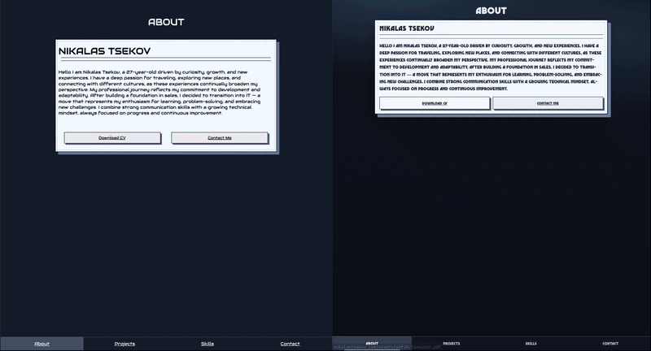

# Portfolio Page Clone

## I did  a copy of my personal website from scratch without using AI, search engines, or VS Code code-helper extensions.

# Tools Used
- VS Code

## The goal was to measure how closely I could recreate my original website without any help.

- This clone was made in four days and with more time I could make it an almost exact match.

- Comparison

## Clone : https://nt411.github.io/Portfolio-Page-Clone/index.html
## Original : www.nikalastsekov.com 
## Left side Clone | Right Side Original 

# TODO: Fix the navbar below 350px width
